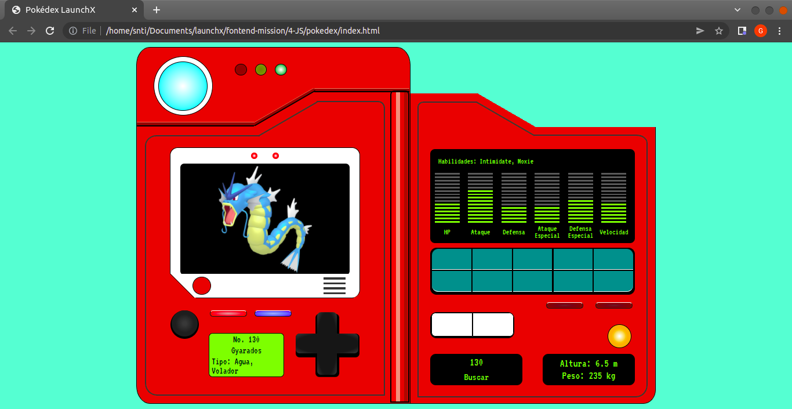
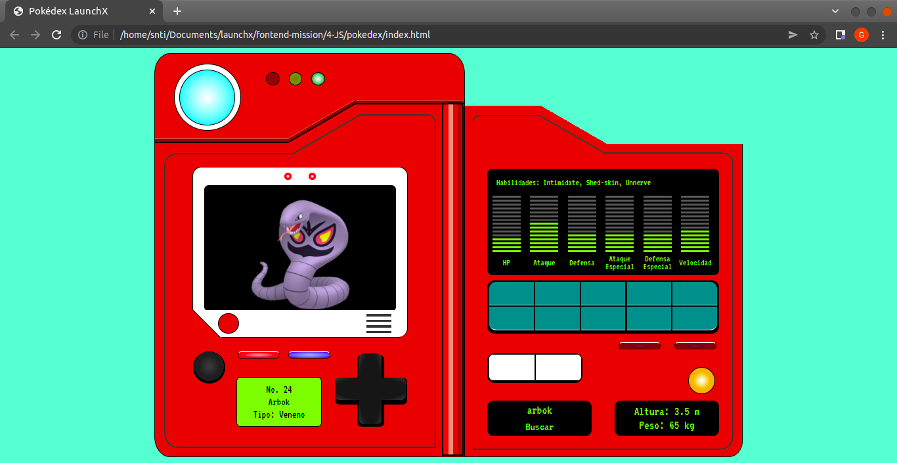
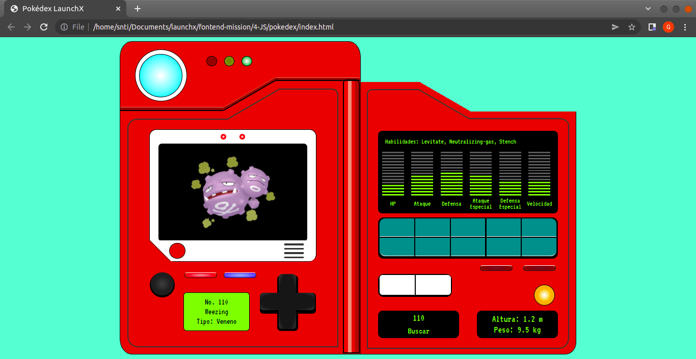

# Pokédex: Launch X - Frontend Mission - JS

## Práctica del módulo 4: JavaScript
Aldo Santiago Castillo

### Práctica
- Maquetación del sitio con HTML
- Diseño con CSS para que parezca un pokedex la página
- Tener un input de entrada, donde se meta el nombre del pokemón a buscar.
- Tomar ese input e ir a consultar el API de [pokeapi](https://pokeapi.co/)
- mostrar en pantalla los siguientes datos del pokemón ingresado:
    - Nombre
    - Imágen
    - Tipo de pokemón
    - Estadísticas
    - Movimientos

Resultado:

